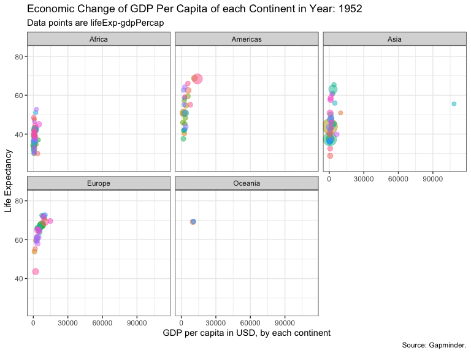
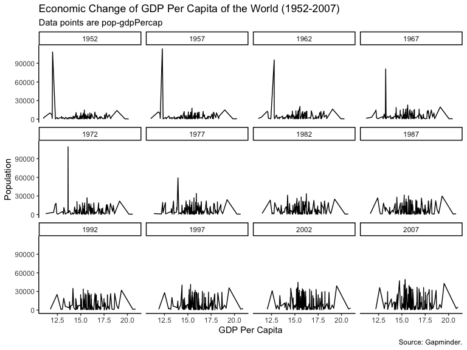

EDA, Animated Visualization, Multivariate Regressions
================
Mohammed Alrashidan

``` r
## Load the libraries we will be using
library(gapminder)
library(socviz)
library(dplyr)
library(tidyverse)
library(reshape2)
library(ggthemes)
library(gganimate)
library(maps)
library(cowplot)
library(viridis)
```

``` r
head(gapminder)
```

    ## # A tibble: 6 x 6
    ##   country     continent  year lifeExp      pop gdpPercap
    ##   <fct>       <fct>     <int>   <dbl>    <int>     <dbl>
    ## 1 Afghanistan Asia       1952    28.8  8425333      779.
    ## 2 Afghanistan Asia       1957    30.3  9240934      821.
    ## 3 Afghanistan Asia       1962    32.0 10267083      853.
    ## 4 Afghanistan Asia       1967    34.0 11537966      836.
    ## 5 Afghanistan Asia       1972    36.1 13079460      740.
    ## 6 Afghanistan Asia       1977    38.4 14880372      786.

# Animation Graph

``` r
  p <- ggplot(data = gapminder, 
              aes(gdpPercap, lifeExp, size=pop, colour = country)) +
  geom_point(alpha = 0.5, show.legend = FALSE) +
  scale_size(range = c(2,12)) +
  facet_wrap(~continent) + theme_bw()
  # Here comes the gganimate specific bits
  
p1 <- p + transition_time(year) + ease_aes("linear")

p1 + labs(title = 'Economic Change of GDP Per Capita of each Continent in Year: {frame_time}', 
          x = 'GDP per capita in USD, by each continent', 
          y = 'Life Expectancy',
          subtitle = "Data points are lifeExp-gdpPercap",
          caption = "Source: Gapminder.")
```

<!-- -->

``` r
# processing the dataframe for ranking to prepare for animation
top_country <- gapminder %>% 
  select(country, year, gdpPercap) %>%
  group_by(year) %>%
  arrange(year, desc(gdpPercap) ) %>%
  mutate(ranks = rank(-gdpPercap, year))

top_country <- top_country[top_country$ranks <= 10,]
top_country <- data.frame(top_country,cc = I(country_colors[match(top_country$country,names(country_colors))]))
top_country$gdpPercap <- round(top_country$gdpPercap,0)
```

``` r
p <- ggplot(top_country, 
            aes(ranks, 
                group=country, 
                fill=as.factor(country), 
                color=as.factor(country))) +
  geom_tile(aes(y = gdpPercap/2, 
                height = 
                  gdpPercap, 
                width = 0.9),
            alpha = 0.8,
            color = NA) +
  
  geom_text(aes(y = 0, label = paste(country, "  ")), vjust = 0.2, hjust = 1.2) +
  geom_text(aes(y=gdpPercap,label = paste(" ",gdpPercap)), hjust=0)+
  
  coord_flip(clip = "off", expand = TRUE) +
  scale_y_continuous(labels = scales::comma) +
  scale_x_reverse() +
  guides(color = FALSE, fill = FALSE) 
```

    ## Warning: `guides(<scale> = FALSE)` is deprecated. Please use `guides(<scale> =
    ## "none")` instead.

``` r
p1 <- p + transition_states(states = year, transition_length = 5, state_length = 1) + 
  ease_aes("cubic-in-out") +
  labs(title = 'GDP Per Capita each Year: {closest_state}\n', 
  subtitle = 'Top 10 Countries',
  caption = "Data Source: Gapminder",
  y='GDP Per Capita', x="")

p1 +
  theme_classic() +
  theme(
    plot.title=element_text(size=20, face="bold", colour="black"),
    plot.subtitle=element_text(size=18, hjust=0.5, face="italic", color="black", vjust=-1),
    plot.caption =element_text(size=8, face="italic", color="black"),
    axis.ticks.y = element_blank(), 
    axis.text.y = element_blank(), 
    plot.margin = margin(1,1,1,4, "cm"))
```

<!-- -->

# Building World’s Map

``` r
library(maps)
world <- map_data("world")
colnames(world) <- c("long","lat", "group", "order", "country", "subregion")
lifeexp07 <- gapminder %>%
  select(country, year, lifeExp)
lifeexp07 <- gapminder %>% filter(year == 2007)
world_exp <- left_join(lifeexp07, world, by = "country")

world_exp <- data.frame(world_exp,cc = I(country_colors[match(world_exp$country,names(country_colors))]))


p <- ggplot(data = world_exp,
            mapping = aes(x = long, y = lat, fill= lifeExp, 
                          group = group, color=country))
p1 <- p + geom_polygon(color = "gray90", size = 0.05) + coord_equal() + 
  labs(title = "Life Expectency of The World, 2007",
       subtitle = 'World Map',
       caption = "Data Source: Gapminder") +
  guides(fill = guide_legend(nrow = 1)) + 
  theme_map() + theme(legend.position = "bottom")
p1
```

<!-- -->

``` r
black <- county_data %>%
  select(id, name, state, pop_dens, black, land_area, pop, pop_dens6) %>%
  mutate(pop_land = (pop / land_area))
county_full <- left_join(county_map, black, by = "id")

p <- ggplot(data = county_full,
            mapping = aes(x = long, y = lat, fill= black, 
                          group = group))
p1 <- p + geom_polygon(color = "gray90", size = 0.05) + coord_equal()


p2 <- p1 + scale_fill_viridis_c()

p2 + 
    guides(fill = guide_legend(nrow = 1)) + 
    theme_map() + theme(legend.position = "bottom") +
  labs(
       title = "A Visualization of US Population, Black",
       subtitle = "Data points: Total Black",
       caption = "Source: county_data") +
  scale_color_brewer(palette = "Set1")
```

<!-- -->

``` r
p <- ggplot(data = gapminder, 
            mapping = aes(x = gdpPercap,
                          y=lifeExp))


p + geom_point() + geom_smooth()  + theme_classic() + 
  labs(x = "GDP Per Capita", y = "Life Expectancy in Years",
       title = "Economic Growth and Life Expectancy of the World",
       subtitle = "Data points are country-years",
       caption = "Source: Gapminder.") 
```

<!-- -->

``` r
p <- ggplot(data = gapminder,
            mapping = aes(x = gdpPercap,
                          y=lifeExp,
                          color = factor(year)))

p  +  geom_point() + geom_smooth() + facet_wrap(~year) + theme_bw() +
  labs(x = "GDP Per Capita", y = "Life Expectancy in Years",
       title = "Economic Growth and Life Expectancy by Years - (1952-2007)",
       subtitle = "Data points are country-years",
       caption = "Source: Gapminder.") 
```

<!-- -->

``` r
p <- ggplot(data = gapminder, mapping = aes(x = gdpPercap, y=lifeExp, color = continent))
p + geom_point(alpha = 0.3) +
    geom_smooth() +
    scale_x_log10(labels = scales::dollar) + theme_classic() +
    labs(x = "GDP Per Capita", y = "Life Expectancy in Years",
         title = "Economic Growth and Life Expectancy by Continent",
         subtitle = "Data points are country-years",
         caption = "Source: Gapminder.") +
  scale_color_brewer(palette = "Set1")
```

<!-- -->

``` r
p <- ggplot(data = gapminder,
            aes(x = year , y = lifeExp))
p + geom_boxplot(aes(group =year),
                 varwidth = F) + 
  facet_wrap(~continent) +
  theme_classic() +
  labs(x = "Years", y = "Life Expectancy",
       title = "Life Expectancy of Each Year by Continent",
       subtitle = "Data points are lifeExp-years",
       caption = "Source: Gapminder.") +
  scale_color_brewer(palette = "Set1")
```

<!-- -->

``` r
p <- ggplot(data = gapminder, 
            mapping = aes(x = log(pop),
                          y = gdpPercap))
p + geom_line() + facet_wrap(~ year) + 
  theme_classic() + 
  labs(y = "Population", x= "GDP Per Capita",
       title = "Economic Change of GDP Per Capita of the World (1952-2007) ",
       subtitle = "Data points are pop-gdpPercap",
       caption = "Source: Gapminder.") +
  scale_color_brewer(palette = "Set1")
```

<!-- -->

# ML Modeling

``` r
library(coefplot)
out <- lm(formula = lifeExp ~ log(gdpPercap) + pop + continent, data = gapminder)

p <- coefplot(out, sort = "magnitude", intercept = TRUE , color="red")
p + theme_economist() + 
  theme(
    plot.title=element_text(face="bold", colour="black", vjust=4),
    plot.subtitle=element_text(face="italic", color="black", vjust=2, hjust = 0),
    plot.caption =element_text(size=10, hjust=1, face="italic", color="black"),
    axis.text.y = element_text(size=10),
    axis.title.y= element_text(size=10, vjust=8, hjust=0.5),
    axis.title.x= element_text(size=10, vjust=-4, hjust=0.5),
    plot.margin = margin(1,1,1,1, "cm")) +
  
  labs(y = "Coeficient", x= "Intercept",
       title = "Multivariate Regression Model",
       subtitle = "Life Expectency Prediction on pop+ GDP per Cap and Continet",
       caption = "Source: Gapminder.") 
```

<!-- -->

``` r
plot(out, which = c(1,2), ask=FALSE) 
```

<!-- --><!-- -->
