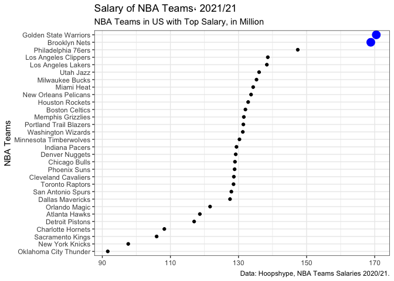
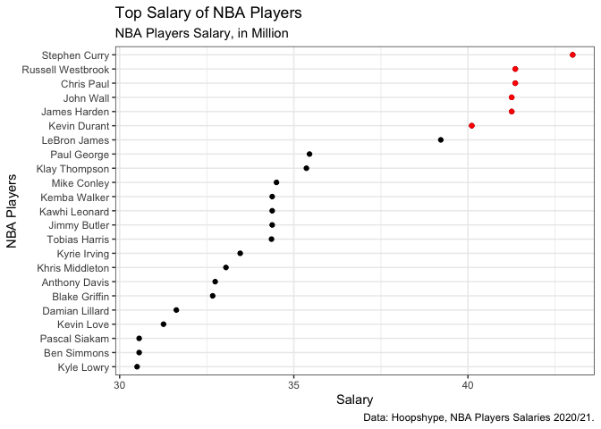
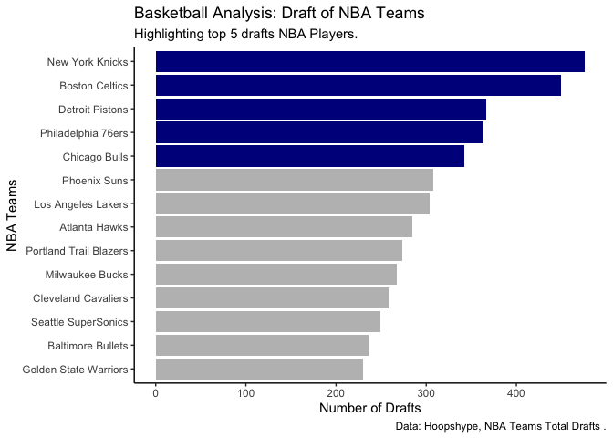
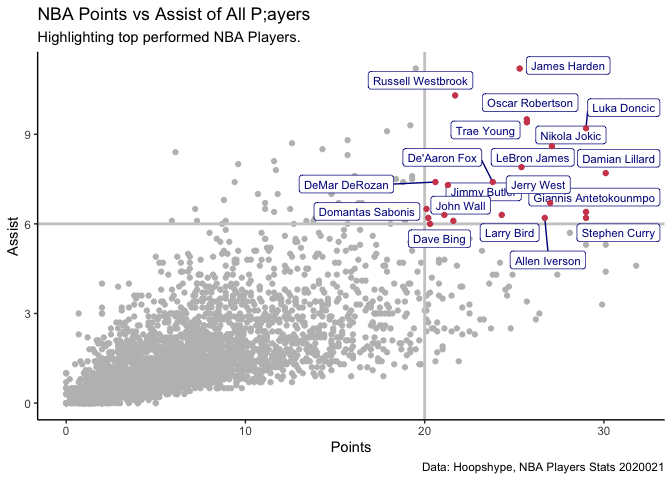
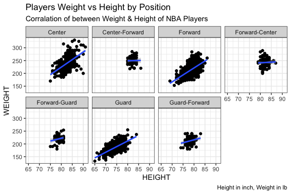
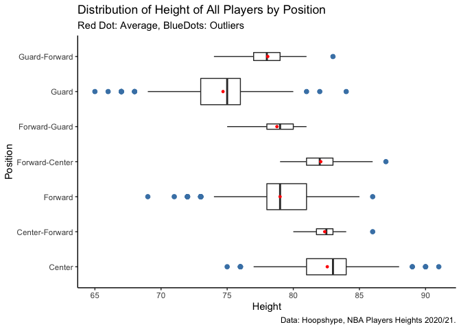
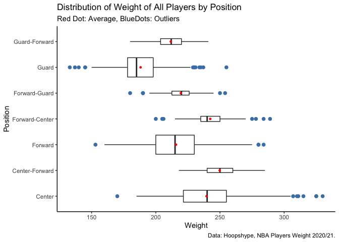
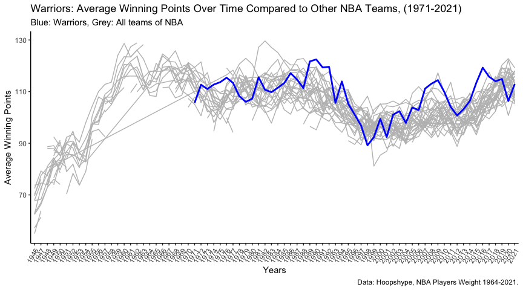

EDA, NBA Analysis
================
Mohammed Alrashidan

### What is the background on the data/methods

Data Source: <https://www.kaggle.com/wyattowalsh/basketball> This is a
Database from SQLite sourced from stats.nba.com, the data is pulled and
been processed and hosted between Kaggle & GitHub by Wyatt Walsh

The data set contains over two decades of data on each player who has
been part of an NBA teams’ roster. It has 16 tables and It captures
demographic variables, biographical details, and box score statistics.

#### *The dataset is described into three factors:*

##### *Games*

It has 60,000+ games (every game since the first NBA season in 1946-47)
including for the games in which the statistics were recorded: Box
scores(points), Game summaries(win,loss), Officials, Inactive players,
Season series info, Game video availability.

##### *Teams*

30 teams with information including: General team details (stadium, head
coach, general manager, social media links, etc), Franchise history
information (name changes, location changes, etc)

##### *Players*

4500 players with basic draft data, Prior affiliations, Career
statistics. Anatomical data (height & weight)

##### Summary with Total (Rows, Columns) of each table in database:

-   *Player\_Attributes* (4500,37): contain players’ background
    information such as name, date of birth, school, weight, heights
-   *Player\_Salary* (1292, 12): has information about the value of the
    player’s salary
-   *Team\_Salary* (30, 9): it has information such as team salary of
    years 21,22,23,24,25
-   Draft (7890, 16) : contain Drafts information for Player level and
    has players previous’ organization affiliation history and the
    current
-   Draft\_Combine (1395, 116): contain players’ deep details of the
    player attributes such as body measurements, performance score,
    agility
-   Game (62393, 149): contain Match information between teams and has
    statistic summary of the match such as win, loss, points, box score
    statistics
-   Game\_Inactive\_Players (98298, 9) : contain players who are active
    and none active per team each season
-   Game\_Officials (64993, 5): players’ name and jersey number
-   News (1195, 33): contain different source of news regarding each
    game, rating, and social media accounts
-   News\_Missing (62, 3): news that are missing from the news table
-   Player (4501,5): contains full name of players and roster status
-   Player\_Bios (42749, 40): it contains the player’s market
    information, that is available such as contract, signed, waived,
    traded
-   Player\_Photos (4593, 17): contain files such as players images
-   Team (30, 7): it has basic information regarding the team’s city,
    year founded
-   Team\_Attributes (30,14): contains team’s internal data such as
    arena name, and arena capacity, coach, owner, general manager and
    social media accounts
-   Team\_History (60, 5): contains current year status if active

``` r
knitr::opts_chunk$set(echo=T, warning=FALSE, message=FALSE)
```

``` r
library(dplyr)
library(tidyverse)
library(tidyr)
library(here)
library(ggplot2)
library(DBI)
library(RSQLite)
library(nbastatR)
library(future)
library(lubridate)
#install.packages("janitor")
#install.packages("gifski")
#install.packages("gganimate")
library(gganimate)
library(janitor)
library(ggrepel)
```

``` r
input <- "/Users/mo/Desktop/Desktop/School/USF/Courses/Spring 2021/Data Visualization/Final Project/archive/basketball.sqlite"
conn <- dbConnect(SQLite(), input)
```

# Extract Needed Tables from Database

``` r
# selecting 3 tables out of 16 from SQLite table to dataframe
Draft                 <- dbReadTable(conn, "Draft")
Game                  <- dbReadTable(conn, "Game")
Player_Attributes       <- dbReadTable(conn, "Player_Attributes")
Player_Salary               <- dbReadTable(conn, "Player_Salary")
Team                          <- dbReadTable(conn, "Team")
Team_Attributes         <- dbReadTable(conn, "Team_Attributes")
Team_Salary           <- dbReadTable(conn, "Team_Salary")
```

``` r
# number of rows in all selected table before manipulation and cleaning
num_rows = nrow(Player_Attributes) + nrow(Player_Salary) + nrow(Team_Salary)
print(paste("Total Rows", num_rows))
```

    ## [1] "Total Rows 5822"

``` r
# number of columns in all selected table before manipulation and cleaning
num_col = ncol(Player_Attributes) + ncol(Player_Salary) + ncol(Team_Salary)
print(paste("Total Columns", num_col))
```

    ## [1] "Total Columns 58"

``` r
# Select dataframes with only required variables
Draft <- Draft %>%
  select(idTeam, idPlayer, namePlayer, nameTeam, cityTeam, yearDraft, numberPickOverall, numberRound, nameOrganizationFrom, typeOrganizationFrom) %>%
  rename(id_player = idPlayer, 
         id_team = idTeam, 
         team_name = nameTeam,
         player_name = namePlayer,
         team_city = cityTeam,
         draft_year = yearDraft)

Game <- Game %>%
  select(GAME_ID, TEAM_ID_HOME, SEASON, TEAM_NAME_HOME, GAME_DATE, WL_HOME, TEAM_NAME_AWAY, WL_AWAY, TEAM_ABBREVIATION_HOME, PTS_HOME) %>%
  rename(id_game = GAME_ID,
         id_team = TEAM_ID_HOME,
         team_name = TEAM_NAME_HOME,
         abbreviation = TEAM_ABBREVIATION_HOME)

# player dataframe
Player_Attributes <- Player_Attributes %>%
  mutate(bir = as.Date(Player_Attributes$BIRTHDATE),
         years_played =  as.integer(Player_Attributes$TO_YEAR) - as.integer(Player_Attributes$FROM_YEAR),
         age = 2021 - year(bir)) %>%
  rename(player_name = DISPLAY_FIRST_LAST,
         team_name = TEAM_NAME) %>%
  select(ID, TEAM_ID, team_name, player_name, SCHOOL, HEIGHT, WEIGHT, POSITION, years_played, DRAFT_ROUND, DRAFT_NUMBER, PTS, AST, REB, age) 


Player_Salary <- Player_Salary %>%
  select(namePlayer, nameTeam, value, slugSeason) %>%
  rename(player_name = namePlayer,
         team_name = nameTeam,
         Player_Salary = value) %>%
  filter(slugSeason == "2020-21")

# Team dataframes 
Team_Attributes <- Team_Attributes %>%
  select(ID, ARENA, ARENACAPACITY) %>%
  rename(id_team = ID)

Team_Salary <- Team_Salary %>%
  select(nameTeam, slugTeam, X2020.21) %>%
  rename(team_name = nameTeam,
         Salary = X2020.21, 
         abbreviation = slugTeam)

Team <- Team %>%
  rename(team_name = full_name,
         id_team = id)
# joining team , team attributes and salary together
team_info <- left_join(Team, Team_Attributes)
team_info <- left_join(team_info, Team_Salary)
team_info <- team_info %>%
  select(id_team,team_name, city, state, year_founded, ARENA, ARENACAPACITY, Salary) %>%
  filter(!is.na(Salary))
# remove NA and empty fields
Player_Attributes <- Player_Attributes[ !(Player_Attributes$TEAM_ID %in% c(1610612762,0)), ]
Player_Attributes <- Player_Attributes[!apply(is.na(Player_Attributes$WEIGHT) | Player_Attributes == "", 1, all),]
```

## Descriptive Statistics and Visualizations

What Teams/Player have highest salary and highlighted the top 2 who has
above 160 million

``` r
p <- ggplot(data = Team_Salary, aes(x =Salary/1000000 , y = reorder(team_name, Salary)))

p1 <- p + geom_point(stat = "identity") + theme_bw() 
p2 <- p1 + geom_point(data = subset(Team_Salary, Salary> 150000000), 
                      aes(x =Salary/1000000, y= reorder(team_name, Salary), size=2,
                          color = I("blue"))) +
  theme(legend.position = "none") +
  labs(x = NULL, y = "NBA Teams",
       title = "Salary of NBA Teams، 2021/21",
       subtitle = "NBA Teams in US with Top Salary, in Million",
       caption = "Data: Hoopshype, NBA Teams Salaries 2020/21.")
p2
```

<!-- -->

Along with showing the team salary, I have answered the following
question regarding which players have the highest salary while focusing
on players that have above 40M Salaries

``` r
Player_Salary_top <- Player_Salary %>%
  filter(Player_Salary >= 30000000) %>%
  select(player_name, Player_Salary)
Player_Salary <- Player_Salary %>%
  filter(!is.na(Player_Salary))

p0 <- ggplot(data = Player_Salary, aes(x =Player_Salary/1000000, y= reorder(player_name, Player_Salary)))

p1 <- p0 + geom_point(data = subset(Player_Salary, Player_Salary> 30000000),
                      aes(x =Player_Salary/1000000, y= reorder(player_name, Player_Salary))) + theme_bw() 
p2 <- p1 + geom_point(data = subset(Player_Salary, Player_Salary> 40000000),
             aes(x =Player_Salary/1000000, y= reorder(player_name, Player_Salary),
                 color = I("red")),
             stat = "identity") + 
  labs(x = "Salary", y = "NBA Players",
       title = "Top Salary of NBA Players",
       subtitle = "NBA Players Salary, in Million",
       caption = "Data: Hoopshype, NBA Players Salaries 2020/21.",
       color = "Legend")
p2
```

<!-- -->

``` r
# number of pick per team
Draft_g <- Draft %>%
  group_by(team_name) %>%
  summarise(picks = sum(numberPickOverall),
            draft_num = n())

p0 <- ggplot(data= Draft_g,  
             aes(x = draft_num, 
                 y = team_name))

p1 <- p0 + geom_bar(stat = "identity",
              data = subset(Draft_g, 
                            draft_num > 211),
                            aes(x = draft_num, 
                                y = reorder(team_name, draft_num),
                                fill = I("grey")))
p2 <- p1 + 
  theme_classic() + geom_bar(stat = "identity",
                             data = subset(Draft_g, 
                                           draft_num > 320),
                             aes(x = draft_num, 
                                 y = reorder(team_name, draft_num),
                                 fill = I("darkblue")))
p2 + labs(x = "Number of Drafts", y = "NBA Teams",
          title = "Basketball Analysis: Draft of NBA Teams",
          subtitle = "Highlighting top 5 drafts NBA Players.",
          caption = "Data: Hoopshype, NBA Teams Total Drafts .")
```

<!-- -->

This is an analysis of how players are performing in games, we can spot
a positive correlation that is, the higher the Points the higher the
Assist. During matches, players tend to score or assist their teammates
to score. Here, we answered the question and identify a critical area
where we have players have highest and highest assists and that makes
them the most performing players. In red points colors and labeled,
shows high performance players while in gray color shows the other 4500
players in the dataset

``` r
p0 <- ggplot(data = subset(Player_Attributes),
             mapping = aes(x = PTS, y = AST,
                           label = player_name))
p1 <- p0 + geom_point(color = "grey") +
  geom_hline(yintercept = 6, size = 1, color = "gray80") +
  geom_vline(xintercept = 20, size = 1, color = "gray80") +
  geom_label_repel(size = 3,
                  data = subset(Player_Attributes, PTS>20 & AST>=6),
                  mapping = aes(x = PTS, y = AST,
                                label = player_name,
                                color = I("darkblue")))

 p1 + geom_point(data = subset(Player_Attributes, PTS>=20 & AST>=6),
                  mapping = aes(x = PTS, y = AST,
                                color = I("#d1495b"))) +
   theme(legend.position="none") +
  labs(x = "Points", y = "Assist",
       title = "NBA Points vs Assist of All P;ayers",
       subtitle = "Highlighting top performed NBA Players.",
       caption = "Data: Hoopshype, NBA Players Stats 2020021") + theme_classic()
```

<!-- -->

``` r
p0 <- ggplot(data = subset(Player_Attributes), mapping = aes(x = HEIGHT, y = WEIGHT))
p1 <- p0 + geom_point()

p2 <- p1 + geom_point(data = subset(Player_Attributes),
             mapping = aes(x = HEIGHT,
                           y = WEIGHT,
                           ),
             alpha = 0.1) + 
  facet_wrap(~POSITION, ncol = 4 ) + geom_smooth(method = "lm") +

  theme(legend.position="right") + theme_bw() +
  labs(title = "Players Weight vs Height by Position",
       subtitle = "Corralation of between Weight & Height of NBA Players",
       caption = "Height in inch, Weight in lb")
p2
```

<!-- -->

``` r
# for Height Statistical analysis
p <- ggplot(data = Player_Attributes, 
            aes(x = HEIGHT, 
                y= POSITION))
p1 <- p + geom_boxplot(aes(group = POSITION),
                       varwidth = TRUE, 
                       outlier.colour = "steelblue", 
                       outlier.size = 2) +
  stat_summary(fun = mean,
               geom  = "point",
               size = 1,
               color = "red") +
  theme_classic()
p2 <- p1 +
  labs(y = "Position",
       x = "Height",
       title = "Distribution of Height of All Players by Position",
       subtitle = "Red Dot: Average, BlueDots: Outliers",
       caption = "Data: Hoopshype, NBA Players Heights 2020/21.")
p2
```

<!-- -->

``` r
# for Weight Statistical Analysis
p <- ggplot(data = Player_Attributes, 
            aes(x = WEIGHT, 
                y= POSITION))
p1 <- p + geom_boxplot(aes(group = POSITION),
                       varwidth = TRUE, 
                       outlier.colour = "steelblue", 
                       outlier.size = 2) +
  stat_summary(fun = mean,
               geom  = "point",
               size = 1,
               color = "red") +
  theme_classic()
p2 <- p1 +
  labs(y = "Position",
       x = "Weight",
       title = "Distribution of Weight of All Players by Position",
       subtitle = "Red Dot: Average, BlueDots: Outliers",
       labels = paste("", c("red", "blue")),
       caption = "Data: Hoopshype, NBA Players Weight 2020/21.")
p2
```

<!-- -->

# Team Case: Golden State Warriors

``` r
#warriors <- Game[Game$team_name == "Golden State Warriors",]
teams <- Game
teams$GAME_DATE <- as.Date(teams$GAME_DATE, format = "%Y-%m-%d")
teams$GAME_DATE <- format(teams$GAME_DATE, "%Y")

teams <- teams %>%
  group_by(GAME_DATE, team_name) %>%
  mutate(avg_pts = mean(PTS_HOME)) %>%
  select(GAME_DATE, avg_pts, team_name) %>%
  distinct()

warriors <- teams[teams$team_name == "Golden State Warriors",]


p <- ggplot(teams, aes(x=GAME_DATE, y=avg_pts, group=team_name)) 

p1 <- p + 
  geom_line(color="grey") + theme_classic() +
  theme(axis.text.x = element_text(angle = 60, hjust = 1), legend.position = "none")

p2 <- p1 +
  geom_line(warriors, mapping= aes(x=GAME_DATE, y=avg_pts, group=1), size=1, color="Blue") 
p3 <- p2 +  labs(y = "Average Winning Points",
       x = "Years",
       title = "Warriors: Average Winning Points Over Time Compared to Other NBA Teams, (1971-2021)",
       subtitle = "Blue: Warriors, Grey: All teams of NBA",
       labels = paste("", c("red", "blue")),
       caption = "Data: Hoopshype, NBA Players Weight 1964-2021.") 
p3
```

<!-- -->
