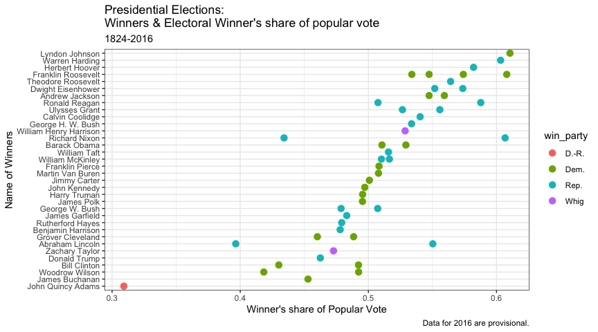
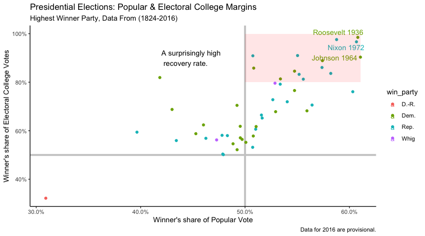

\[Mohammed Alrashidan\]

``` r
head(elections_historic)
```

    ## # A tibble: 6 x 19
    ##   election  year winner       win_party ec_pct popular_pct popular_margin  votes
    ##      <int> <int> <chr>        <chr>      <dbl>       <dbl>          <dbl>  <int>
    ## 1       10  1824 John Quincy… D.-R.      0.322       0.309        -0.104  1.13e5
    ## 2       11  1828 Andrew Jack… Dem.       0.682       0.559         0.122  6.43e5
    ## 3       12  1832 Andrew Jack… Dem.       0.766       0.547         0.178  7.03e5
    ## 4       13  1836 Martin Van … Dem.       0.578       0.508         0.142  7.63e5
    ## 5       14  1840 William Hen… Whig       0.796       0.529         0.0605 1.28e6
    ## 6       15  1844 James Polk   Dem.       0.618       0.495         0.0145 1.34e6
    ## # … with 11 more variables: margin <int>, runner_up <chr>, ru_part <chr>,
    ## #   turnout_pct <dbl>, winner_lname <chr>, winner_label <chr>, ru_lname <chr>,
    ## #   ru_label <chr>, two_term <lgl>, ec_votes <dbl>, ec_denom <dbl>

``` r
p_title <- "Presidential Elections: \nWinners & Electoral Winner's share of popular vote"
p_subtitle <- "1824-2016"
p_caption <- "Data for 2016 are provisional."
x_label <- "Winner's share of Popular Vote"
y_label <- "Name of Winners"

p <- ggplot(elections_historic,
            mapping = aes(x = popular_pct, y = reorder(winner, popular_pct),
                                    label = winner_label, color = win_party))
p + geom_point(size=3) + theme_bw() +
    labs(x = x_label, 
         y = y_label, 
         title = p_title, 
         subtitle = p_subtitle,
         caption = p_caption)
```



``` r
p_title <- "Presidential Elections: Popular & Electoral College Margins"
p_subtitle <- "Highest Winner Party, Data From (1824-2016)"
p_caption <- "Data for 2016 are provisional."
x_label <- "Winner's share of Popular Vote"
y_label <- "Winner's share of Electoral College Votes"


p <- ggplot(elections_historic, aes(x = popular_pct, y = ec_pct,
                                    label = winner_label, color = win_party))

# --------
p + geom_hline(yintercept = 0.5, size = 1.4, color = "gray80") +
    geom_vline(xintercept = 0.5, size = 1.4, color = "gray80") +
    geom_point(data = subset(elections_historic, popular_pct > 0.3),) +
    geom_text_repel(data = subset(elections_historic, ec_pct > 0.8 & popular_pct > 0.6 )) +
    scale_x_continuous(labels = scales::percent) +
    scale_y_continuous(labels = scales::percent) +
    theme_classic() +
    annotate(geom = "rect", xmin = 0.5, xmax = max(elections_historic$popular_pct), 
                            ymin = 0.8, ymax = 1, fill = "red", alpha = 0.1) +
    annotate(geom = "text", x = 0.42, y = 0.9,
             label = "A surprisingly high \n recovery rate.", hjust = 0) + 
    labs(x = x_label, 
         y = y_label, 
         title = p_title, 
         subtitle = p_subtitle,
         caption = p_caption)
```


